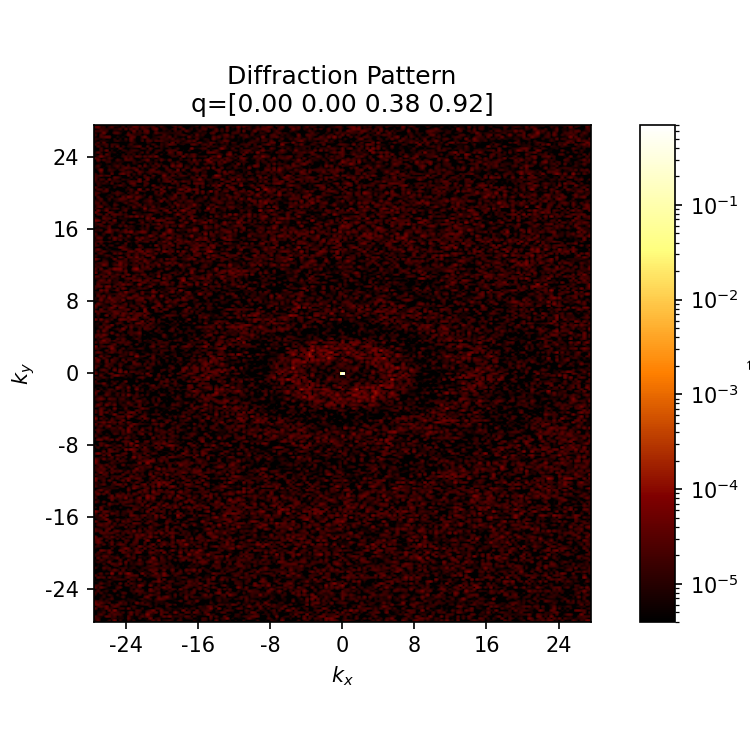

# Efficient Molecular Modeling of Organic Photovoltaics
   
##  Jankowski's Lab in June-July 2021
### Funded for by the National Science Foundation's Research Experience for Teachers (NSF-RET) at Boise State University 
  
Computational modeling is used in Dr. Jankowski’s lab to accelerate the identification
of suitable organic photovoltaics (OPV), an emerging technology in solar panel development.
Structural and electronic properties can be predicted using computer models of more
candidate OPV materials than can be tested with wet lab experiments. From these
predictions researchers can identify the best OPV candidates more inexpensively than
without modeling. Learning how to assemble and organize these computer simulations was
the joint objective of Dr. Jankowski’s RET and REU students in 2021.
  
# Files included: 
* Jupyter Notebooks for creating RDFs and diffraction patterns using the Gaff force-field
* Scientific poster presented at the [Idaho Conference on Undergraduate Research](https://www.boisestate.edu/icur/) highlighting the work completed between a team of undergraduates and myself. 
* Middle School STEAM Lesson Plan for Solar Tiny House using Micro:bits and MakeCode programming

